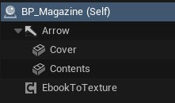
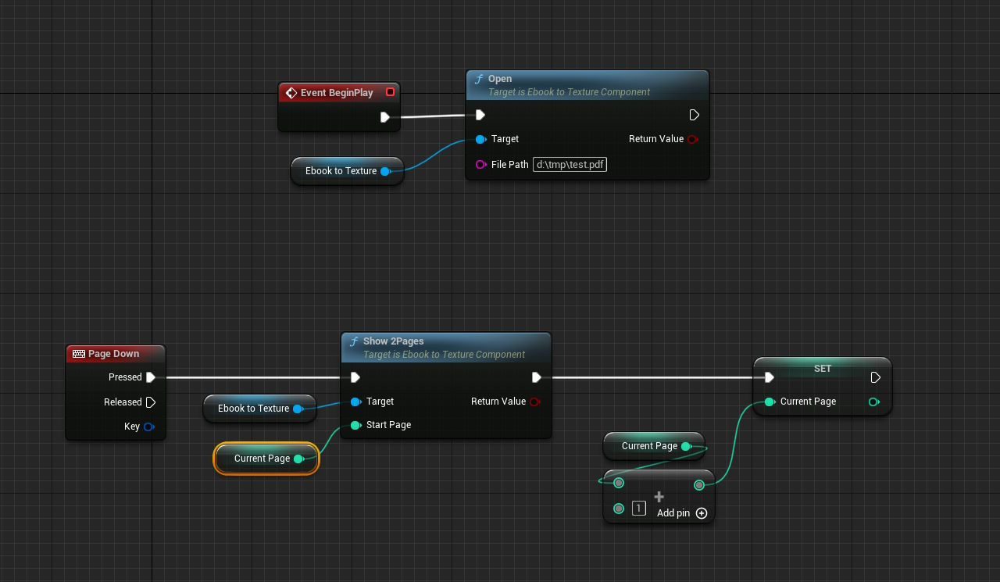

# Unreal eBook viewer plugin

## What you get

An Unreal 5 compatible plugin that lets you load an eBook and display its contents on a material.

In the box:

- A "helper DLL" that wraps up `libmupdf` functionality to provide a simple way of getting a single page, or 2 pages side-by-side, into an existing buffer
- A plugin for Unreal to use the helper DLL to display the specified page(s)
- A material setup to display the pages

## How to use it

- Make a new Unreal C++ project
- Put the plugin in your plugins folder (create `Plugins` if it doesn't exist)
- Run Unreal from Visual Studio using `CTRL-F5` so it compiles the plugin
- Create a new Blueprint actor
- Add a static mesh to it
- Assign the `M_Magazine` material to the static mesh (ensure the material has the texture set to `blank1024`)
- (for further texture and material setup see [here](https://github.com/noshbar/UE5_DynamicTexture_Sample))
- Add a `EBookToTexture` component to your actor  

- Add some events to load the book and change pages  

Note 1: If you're struggling to get the DLL's to load, ensure to copy the helper DLL and `libmupdf.dll` into a place where Unreal will look for them (one of the binary folders, if you try run the project, then Unreal will state in the output log where it tried looking, probably something like `Plugins\EbookToTexture\Binaries\Win64`).

Note 2: if you're struggling to compile `libmupdf` as a DLL, then [the Sumatra project](https://github.com/sumatrapdfreader/sumatrapdf/tree/master) has a Visual Studio 2022 solution already set up to do just that.

## WHY?

Why what?

Why do I have a DLL wrapping a DLL? Well, because that means I don't have to recompile the plugin every time, and I can just restart my project and BAM, updated.

Why an eBook viewer in Unreal? Well, why anything?

Why isn't the page count returned? Because I didn't need it for testing, and I'd rather get this into Github before I bork everything up.

## Attribution

This uses [`libmupdf`](https://github.com/ArtifexSoftware/mupdf) from [Artifex Software](https://www.mupdf.com/), and as such is under the [AGPL3 license](https://www.gnu.org/licenses/agpl-3.0.txt)
